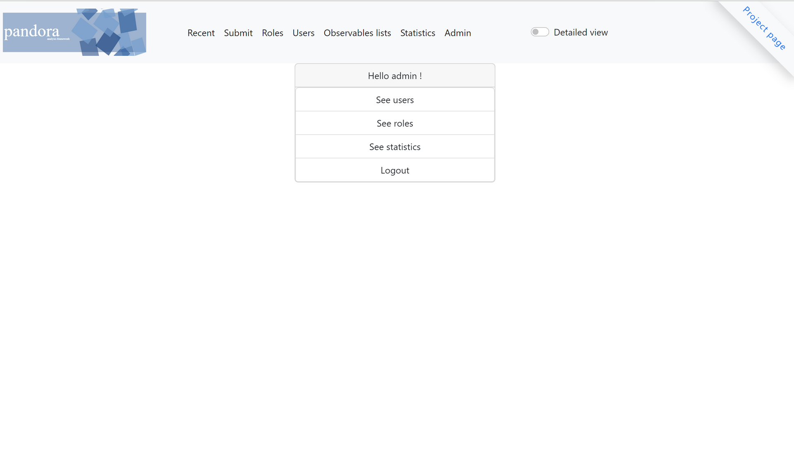
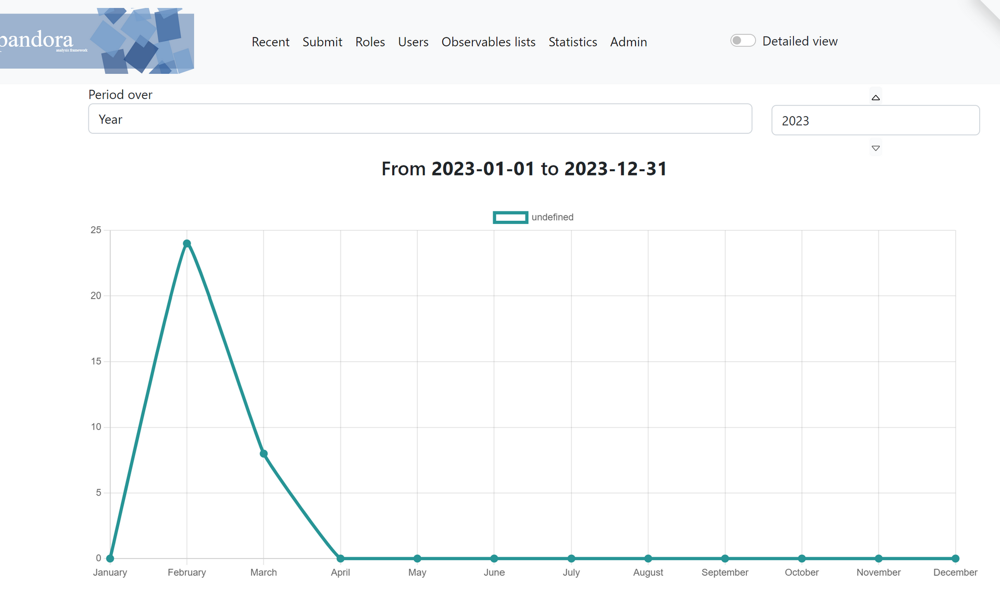

# Administration Guide

## Web Interface console

the administration console is: [http://pandora/admin](http://pandora/admin)



### Users’ admins

in generic.json , add users in the key users

```json
  {
    "users": {
      "admin1":"password1", 
      "admin2":"password2"
    }
  }
```

after adding users, restart Pandora

```bash
sudo services pandora restart
```

## Statistics and reports

in generic.json you can setup a delay index for the reports in the *Recent* menu

the key is by default is 3 days

```json
  {"max_delay_index": 3}
```

You have access to the statistics submission in *Statistics* menu.



## setup email

In generic.json, you can setup for receiving emails for specific reports.

```json
  {
    "email": {
        "smtp_host": "localhost",
        "smtp_port": "25",
        "to": ["Investigation Team <investigation_unit@myorg.local>"],
        "from": "Pandora <pandora@myorg.local>"
    },
    "email_smtp_auth": {
        "auth": false,
        "smtp_user":"johndoe@myorg.local",
        "smtp_pass":"password",
        "smtp_use_tls": false
    }
  }
```

The key *email* is for smtp configuration and the email contacts.

if you have to use authentication and TLS, you'll have to setup *email_smtp_auth* dict.

choose *true* for authentication for the key *auth*
and setup user, passwords for the keys *smtp_user* and *smtp_pass*

For TLS, choose *true*  for the key *smtp_use_tls*

## Docker setup

change in generic.json the *storage_db_hostname*

```json
  {
    "storage_db_hostname": "kvrocks",
    "storage_db_port": 6101
  }
```

#### ClamAV

Change *socket_path* in the ClamAV worker configuration (`/pandora/workers/clamav.yml`) (see [ClamAV Docker Documentation](https://docs.clamav.net/manual/Installing/Docker.html#unix-sockets)).

```yaml
settings:
  socket_path: /var/run/clamav/clamd.sock
```
